前一阶段我在keijiro的github仓库（ https://github.com/keijiro/ShaderSketches）中看到一些很赞的ShaderSketch。这些是用glsl语法写的，我把他放到shodertoy上。

Sketch_Boxes
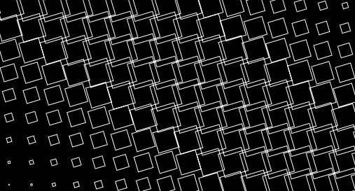
https://www.shadertoy.com/view/4d2yWh

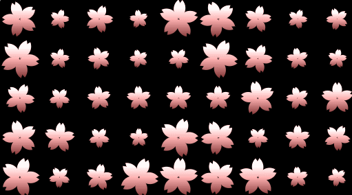

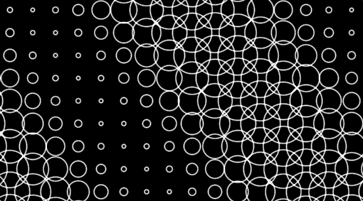

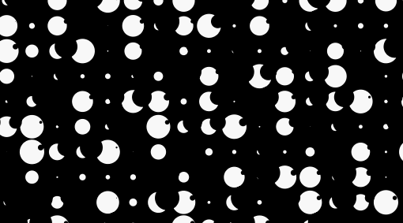

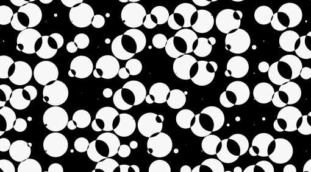

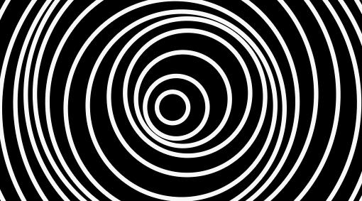

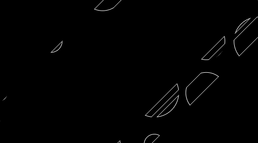

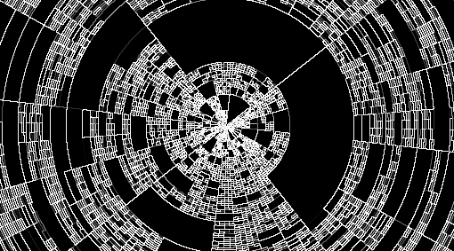

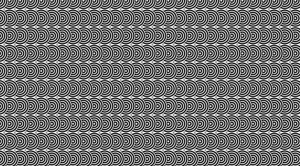

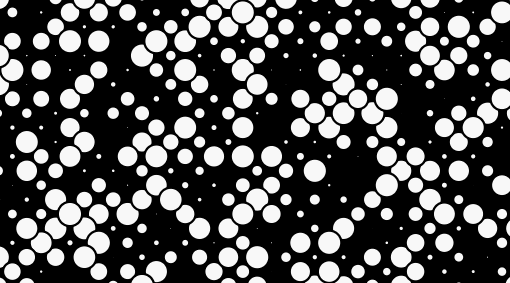

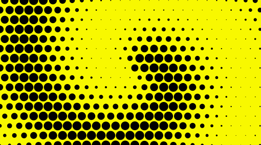

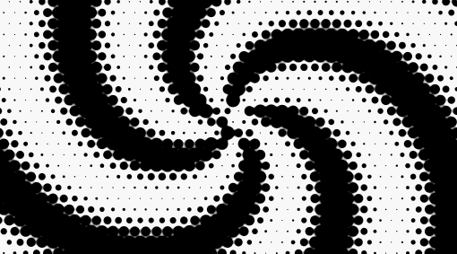

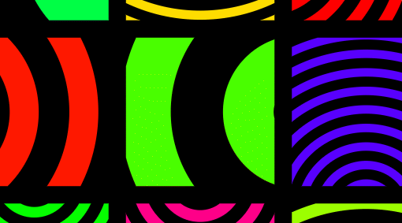

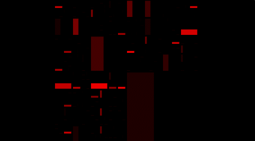

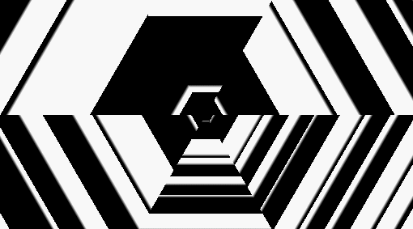

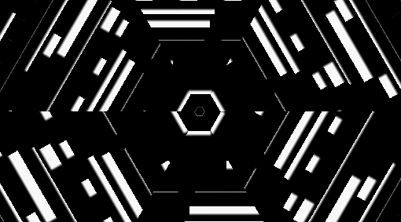

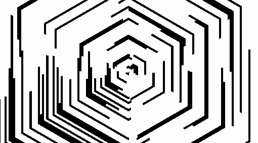

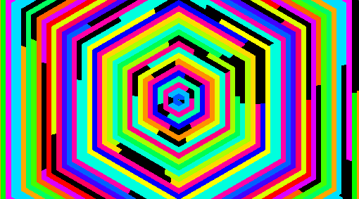

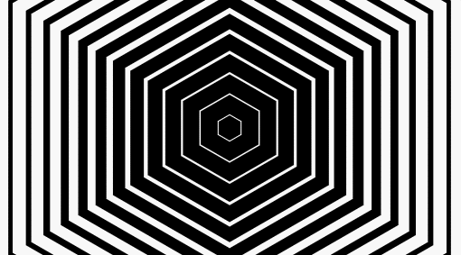

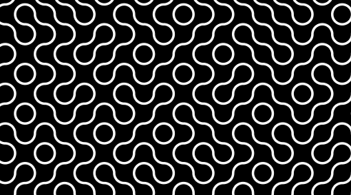

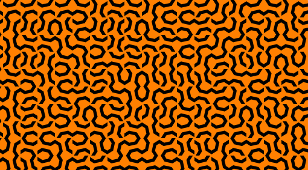

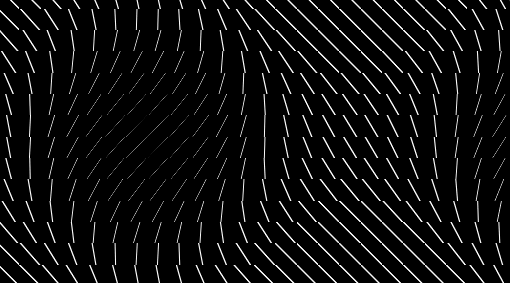

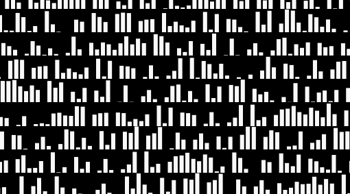

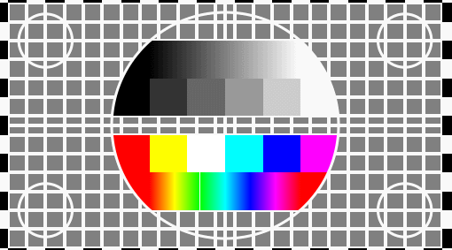

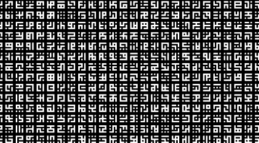

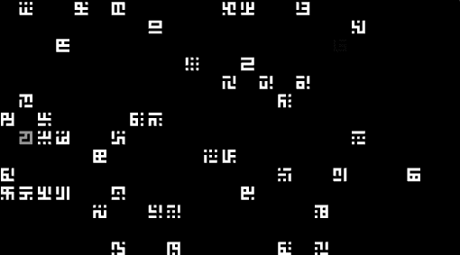

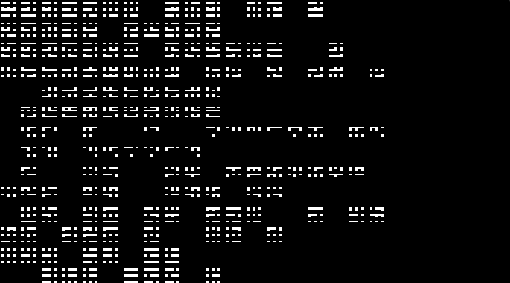

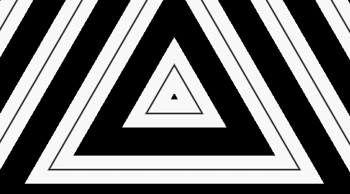

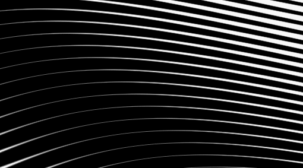
